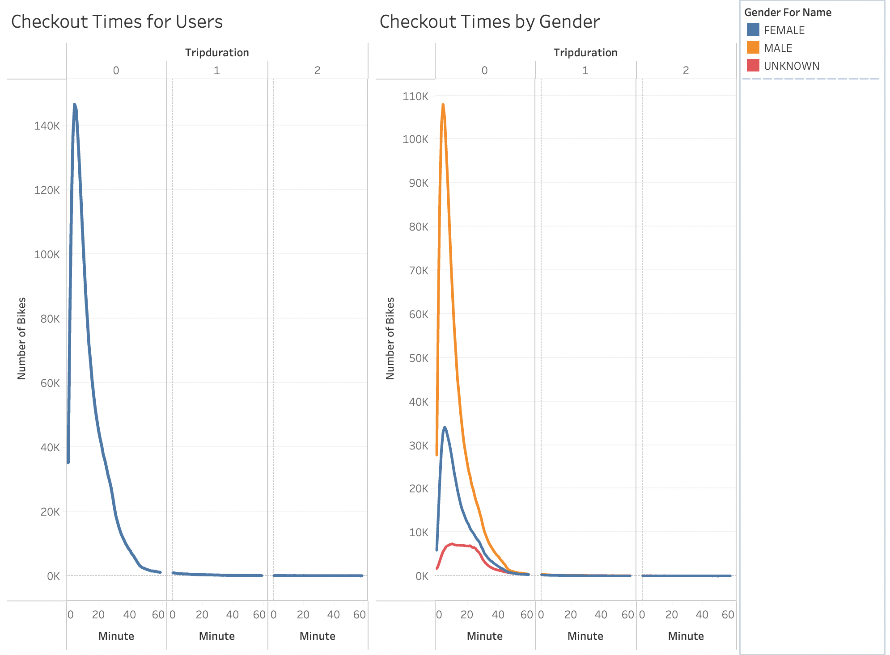
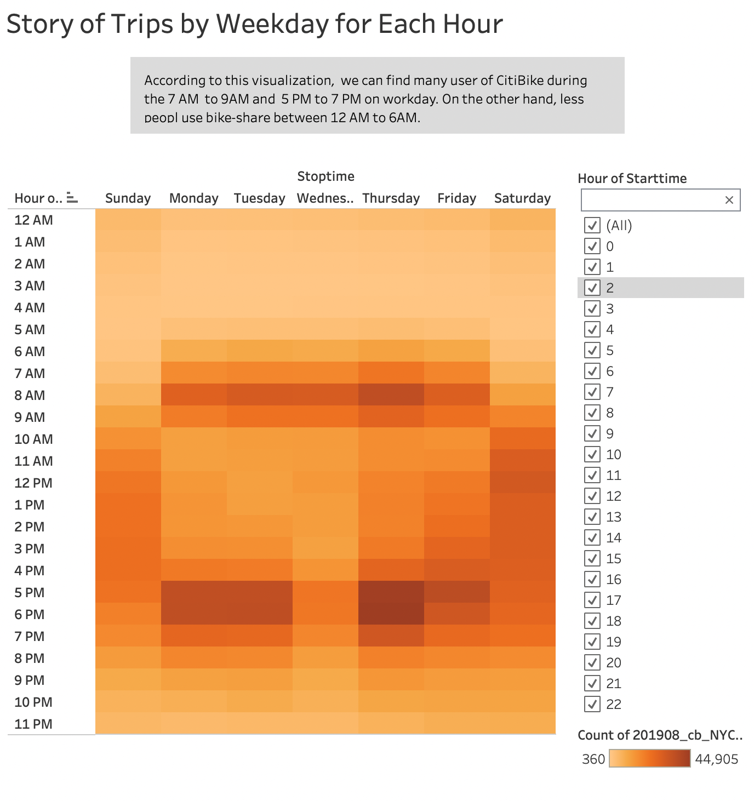
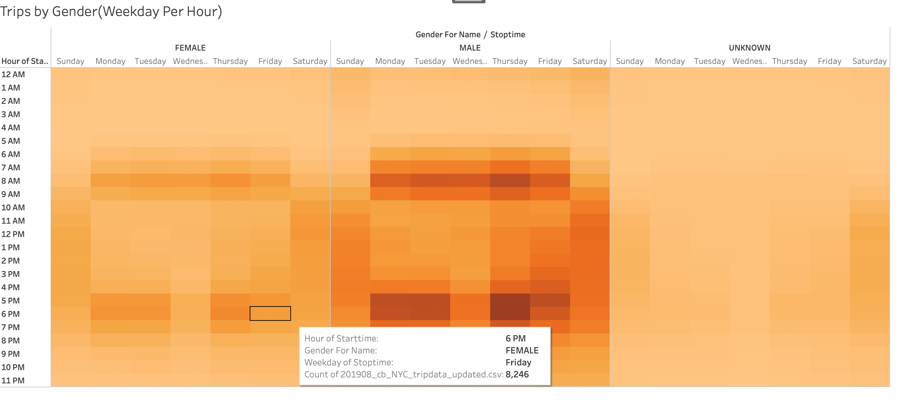
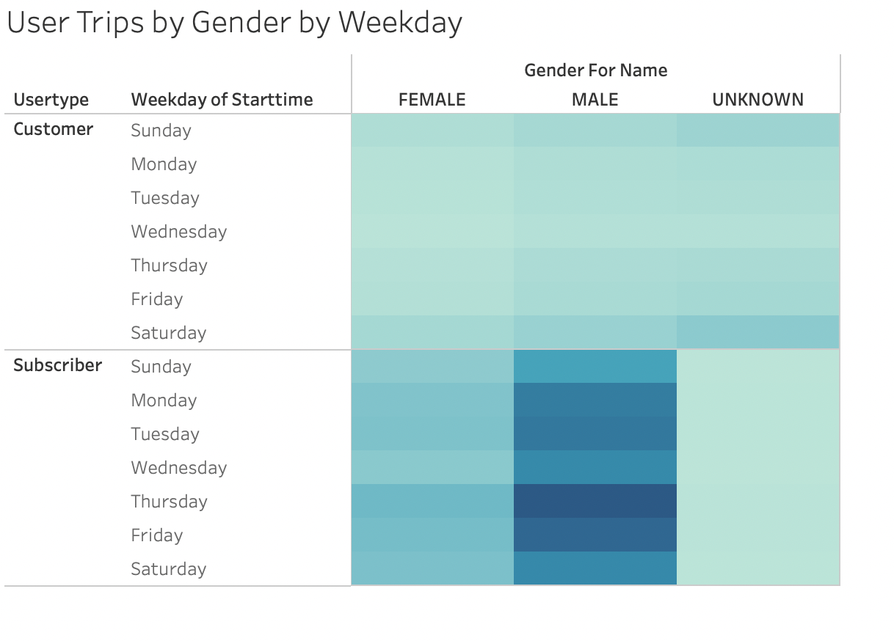
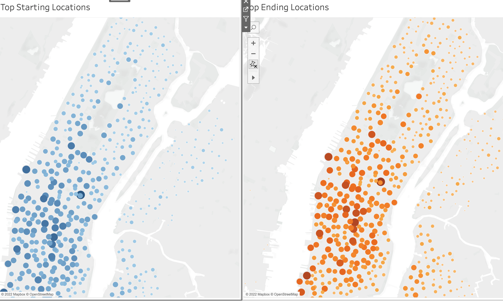
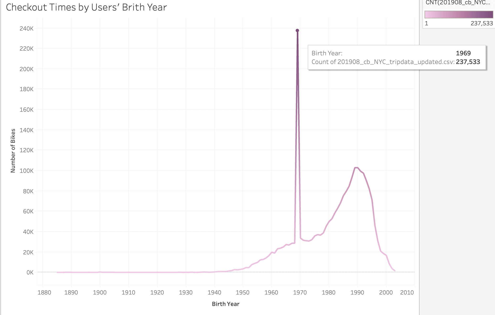

# bikesharing
## Purpose of the Analysis:
Use the Tablelu to figure how CitiBile bike-share bussiness actually workis in New York City.I will create a propsal on how it might work in Des Moines.
[link to dashboard](https://public.tableau.com/app/profile/yicong.luo/viz/Bike_16446964500340/StoryofTripsbyWeekdayforEachHour?publish=yes)
## Results

This graph show the most people use the bike for 5 minutes trip, and most of bike-share users are male, which is almost 3 times female.

This graph show us most users are male and most user use the bike during the rush hour.

This graph show us subscribers use more bike-share services than consumers.

This graph show us top location in New York,which mean we need build more bike station near these points.

This graph show us the user who brith during 1965 and 1970 are the main consumer.

## Summary
Male are the main user for bike-share service. Most users use the service during the rush hour. Most users use the serivce in downtown area.

There two additional visualizations are suggested for future analysis:
1. average trip duration by different age,then we provide different  discount bundle for different age.
2. add weather information to find correlation between the weather and the rides
